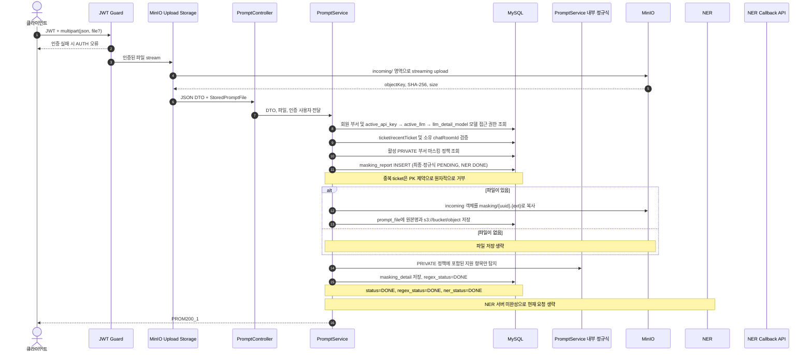

# 마스킹 요소 탐지 요청 흐름

## 계층별 책임 경계

| 구성요소 | 책임 |
|---|---|
| `ParsePrePromptJsonPipe` | multipart의 JSON 파싱 및 요청 형식 검증 |
| `PromptFileInspectorTransform` | 파일 형식·크기 검증과 SHA-256 계산 |
| `PromptMinioStorage` | 업로드 stream을 MinIO `incoming/`으로 전달 |
| `PromptController` | HTTP 입력을 받아 `PromptService`에 전달하고 응답을 통일 |
| `PromptService` | 요청 참조·모델·채팅방 검증, 정책 조회, 파일 확정 및 정규식 탐지 수행 |
| `MaskingReportRepository` | 티켓 생성, 상세 저장 및 상태 전이 |
| `MinioObjectStorageService` | MinIO 객체 I/O와 서명 URL 생성 |
| `global/ner/NerClient` | 향후 NER 연동용 클라이언트(현재 분석 요청에서는 미사용) |
| `NerCallbackController` | NER 콜백 입력을 `PromptService`에 전달 |

`incoming/` 객체는 요청 종료 시 보상 삭제합니다. 최종 파일은 staging에서
생성한 UUID 파일명을 유지해 `masking/{uuid}.{ext}`에 저장합니다.
`prompt_file.file_url`의 canonical `s3://{bucket}/{objectKey}` 값에서
다운로드에 필요한 버킷과 객체명을 복원합니다. 운영 환경에서는 `incoming/`
prefix에 lifecycle 만료 정책을 적용해 비정상 종료로 남은 객체를 정리합니다.

NER 서버 요청은 아직 실행하지 않습니다. 비활성화 기간에는 NER 분기를
생성 시점부터 `DONE`으로 두므로, 정규식 완료 후 정상 접수 상태는
`status=DONE`, `regex_status=DONE`, `ner_status=DONE`입니다.

파일은 탐지 정책을 기록하기 위한 원본으로 보관하며, 실제로 가린 별도 파일을
생성하지 않습니다. 파일 NER 분석이 재개되면 `masking_detail`에는 파일 URL과
일치한 정책만 저장하고, 파일 객체 자체는 변경하지 않습니다.

전송으로 이어지지 않은 `MASKING` 프롬프트 로그는 보고서 생성 시점부터 24시간이
지나면 정리 워커가 삭제합니다. 이때 `masking_report.status`만 `CANCEL`로 전환하며
탐지 상세와 파일 메타데이터는 감사 기록으로 보존합니다. `PENDING`/`DONE` 로그는
이 만료·취소 대상이 아닙니다.

## 외부 LLM API 키와 모델 접근 권한

`POST /admin/v1/departments/{departmentId}/apis`는 `TOTAL_ADMIN`이 부서에
외부 LLM API 키를 등록하는 경로입니다. 서비스 값은 대소문자를 구분하지 않고
`Gemini`, `GPT`, `Claude`만 허용합니다. 검증을 통과한 키는 AES로
암호화해 `active_api_key`에 저장합니다. 필터링 강제 전송(`true`)과 부서 한도
(`0`은 무제한)는 키별 설정이 아니라 `department`의 공통 설정으로 저장합니다.

등록 시 서비스별 모델명 접두사와 일치하는 `llm_detail_model`을 찾아
`active_llm`으로 연결합니다. 매핑은 `Gemini → gemini`, `GPT → gpt`,
`Claude → claude`이며 접두사 비교도 대소문자를 구분하지 않습니다. 분석과
모델 목록 조회는 이 `active_api_key → active_llm → llm_detail_model` 경로로
부서의 사용 가능 모델을 판별합니다.

`mustFiltering=true`인 부서는 탐지 상세가 하나라도 있으면 외부 LLM 전송을
거부합니다. 탐지 상세가 없을 때는 외부 전송을 허용하며, `mustFiltering=false`이면
탐지 여부와 관계없이 허용합니다. 이 설정은 로컬 LLM의 LPL `/generate` 호출에는
적용하지 않습니다.

## 운영 전 정책

- `masking/` 원본에는 서비스 보존 기간에 맞춘 비공개 버킷 lifecycle 정책을 적용합니다.
- 운영 환경의 MinIO·NER·콜백 URL은 TLS 구간으로 구성합니다.
- DB 기록 직후 프로세스가 종료되어 `PENDING`이 남는 경우를 복구하려면
  Outbox 또는 주기적인 재처리 워커를 추가합니다.
- 요청 이후 회원 부서나 정책이 변경되어도 동일 기준으로 콜백을 처리해야 한다면
  요청 시점의 `department_id`와 정책 snapshot을 리포트에 보존합니다.
