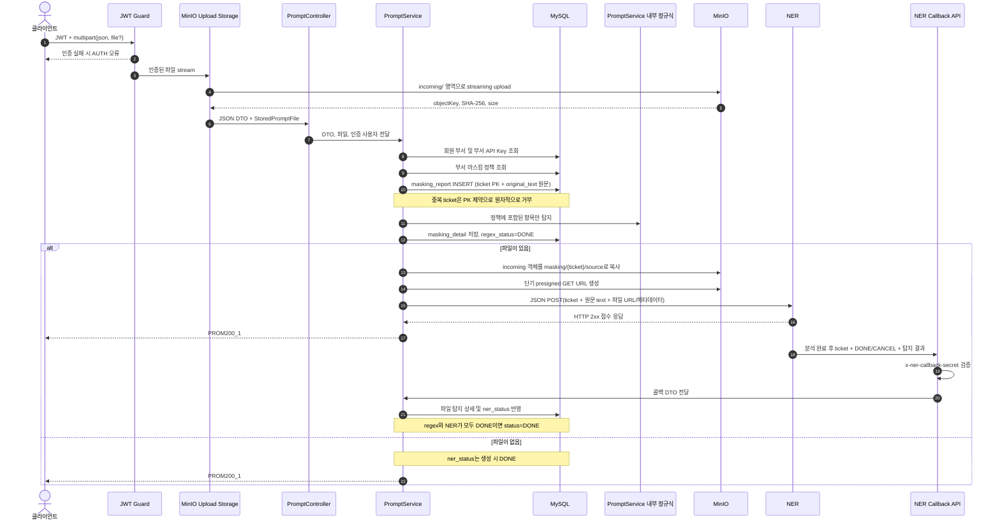

# 마스킹 요소 탐지 요청 흐름

## 계층별 책임 경계

| 구성요소 | 책임 |
|---|---|
| `ParsePrePromptJsonPipe` | multipart의 JSON 파싱 및 요청 형식 검증 |
| `PromptFileInspectorTransform` | 파일 형식·크기 검증과 SHA-256 계산 |
| `PromptMinioStorage` | 업로드 stream을 MinIO `incoming/`으로 전달 |
| `PromptController` | HTTP 입력을 받아 `PromptService`에 전달하고 응답을 통일 |
| `PromptService` | 분석 요청·권한·정책·정규식 탐지·NER 콜백 비즈니스 로직 수행 |
| `MaskingReportRepository` | 티켓 생성, 상세 저장 및 상태 전이 |
| `MinioObjectStorageService` | MinIO 객체 I/O와 서명 URL 생성 |
| `global/ner/NerClient` | 텍스트·서명 파일 URL을 NER 서버에 JSON POST |
| `NerCallbackController` | NER 콜백 입력을 `PromptService`에 전달 |

`incoming/` 객체는 요청 종료 시 보상 삭제합니다. 최종 파일은 티켓으로
결정되는 `masking/{ticket}/source`에 저장하므로 별도 DB 객체 키 컬럼이
필요하지 않습니다. 운영 환경에서는 `incoming/` prefix에 lifecycle 만료
정책을 적용해 비정상 종료로 남은 객체를 정리합니다.

`.env`의 `NER_SERVER_IP`에는 `127.0.0.1:8000` 또는
`https://ner.internal`처럼 NER 서버 주소 하나만 설정합니다. 현재 분석 API
경로는 명세가 없어 루트(`/`)를 사용하며, 경로 확정 시 `NerConfig`의
`NER_ANALYZE_PATH`만 변경합니다.

## 운영 전 정책

- `masking/` 원본에는 서비스 보존 기간에 맞춘 비공개 버킷 lifecycle 정책을 적용합니다.
- 운영 환경의 MinIO·NER·콜백 URL은 TLS 구간으로 구성합니다.
- DB 기록 직후 프로세스가 종료되어 `PENDING`이 남는 경우를 복구하려면
  Outbox 또는 주기적인 재처리 워커를 추가합니다.
- 요청 이후 회원 부서나 정책이 변경되어도 동일 기준으로 콜백을 처리해야 한다면
  요청 시점의 `department_id`와 정책 snapshot을 리포트에 보존합니다.
